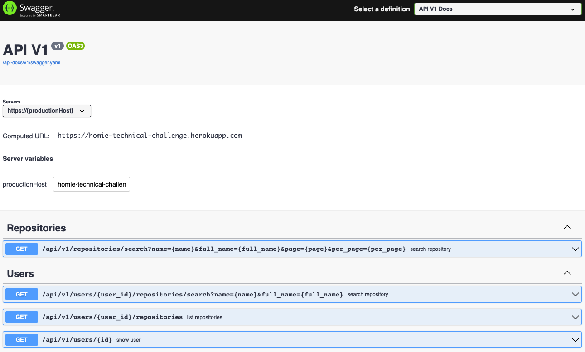
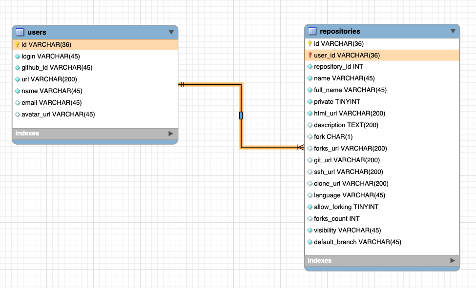
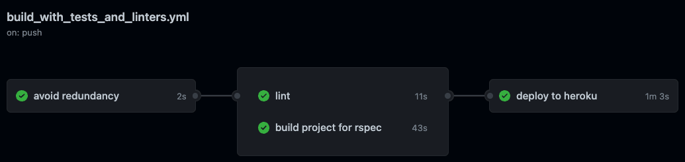

[](https://github.com/joalbertg/homie-challenge/actions/workflows/build_with_tests_and_linters.yml)

# Homie Backend Challenge

- Heroku: [health_check](https://homie-technical-challenge.herokuapp.com/health_check)
- Swagger: [api-docs](https://homie-technical-challenge.herokuapp.com/api-docs/index.html)
- Sidekiq: [sidekiq](https://homie-technical-challenge.herokuapp.com/sidekiq)

## Swagger

<p align="center">
  <kbd>
    
  </kbd>
</p>

## Entity-relationship model

<p align="center">
  <kbd>
    
  </kbd>
</p>

---

## Github Repositories Catalog (Backend)

### Description

For this challenge you have to implement a basic catalog for a github user's repository.
It has to import all repositories for a given user to the database, implement required relationships if any.
And you have to create an endpoint that allows you to search a repository by name.

You must use the Github API (It is public and free!) to fetch the information about any public user.

**NOTE:** There is code already on the project that you are encouraged to improve, refactor or rewrite as needed.
It has mistakes on purpose and finding and fixing this mistakes gives you extra points

### Stack

- [x] Ruby on Rails
- [x] PostgreSQL
- [ ] Searchkick with OpenSearch
- [x] ActiveJob with Sidekiq
- [x] Redis

### What are we going to evaluate?

- How to import data from an external API
- How well structured is your code (avoid huge classes/functions)
- How search feature is implemented
- How tests handles the happy path

### Minimum Required

- [x] Repositories and User data stored on the database (You are free to define the models and relationships if required)
- [x] Search feature for repositories (Naive search is okay)
- [x] Unit tests
- [x] Integrations tests
- [x] Basic endpoint security. (Validate required / optional parameters and user input sanitization)

### Nice to have extras

- [x] OpenAPI Schema Definitions
- [x] Advanced filtering (See available filters on: <https://github.com/yknx4?tab=repositories>)
- [ ] Integration with existing tools (ie. Searchkick)
- [x] Graceful error handling
- [x] Background Synchronization of API
- [ ] Retry strategy on failues
- [x] Caching
- [x] Pagination
- [x] Meaningful Logging
- [x] Add useful gems for development
- [x] Anything... Your imagination is the limit

---
## QuickStart

### Configuration

* ruby `3.1.1p18` (2022-02-18 revision 53f5fc4236) [x86_64-linux-musl]
* Rails version: `7.0.3`
* Docker version `20.10.14`, build a224086

### Build project

```shell
docker compose build api
```

### Create database

```shell
docker compose run --rm api rails db:create
```

### Initialize database

```shell
docker compose run --rm api rails db:migrate
```

### Local deployment

```shell
docker compose up
```
## Health check

> go to link `localhost:3000/health_check`

## Deploy on Heroku (only on main branch)

- create the next secrets in the repository

```shell
secrets.HEROKU_API_KEY
secrets.HEROKU_API_APP
secrets.HEROKU_API_EMAIL
```

- create an app on Heroku

```shell
heroku create --region us <APP-NAME>
```

- copy the `<APP-NAME>` to `HEROKU_API_APP`
- create authorizations

```shell
heroku authorizations:create
```

- copy the Token to `HEROKU_API_KEY`
- copy your heroku account email to `HEROKU_API_EMAIL`

## Workflow

<p align="center">
  <kbd>
    
  </kbd>
</p>
